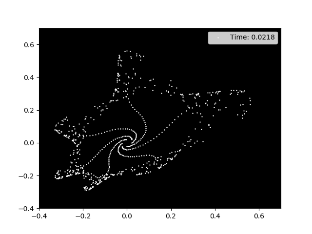

# Chaos-Equation-Visualizer
A simple python script to visualize chaos equations.

## Introduction

This repository contains a Python script to draw an animation of the Chaos equations. I was inspired by the video of [CodeParade](https://www.youtube.com/watch?v=fDSIRXmnVvk). For more information about chaos equations check [here](https://en.wikipedia.org/wiki/Chaos_theory).

## Requirements
You should install the following:

* Python
* Matplotlib
* Numpy
* Pygame(optional)

## How to use
Just open the script and press run. To check different chaos equations just change equations in `x1` and `y1`. You can also try to modify the `tini`, `tend`, `dt` and `resolution` values to discover local behaviours.

## Example

   
  <i> Result of the script </i>

## Future functionalities
In future versions I would like to add a vector plot to show the behavior of each point as the time passes.
I would also try to add other interesting equations to be available for plotting.

## Surprise!
`look inside extra folder there's something a bit colorful :D`
